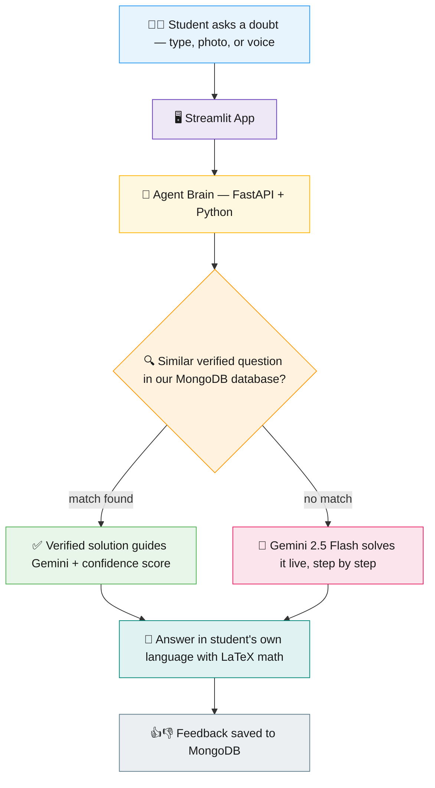

# JEE Solver Agent 

> **Your personal JEE tutor — instant, verified, in your language.**

Late-night JEE preparation often leaves students stuck on complex physics and math problems with no immediate help available. The **JEE Solver Agent** bridges this gap: a 24/7 personalized, human-like tutor that doesn't just give final answers, but breaks down concepts step-by-step using text, voice, and image inputs — with every answer **grounded in a verified PYQ database** so it never hallucinates a formula.

Built for the **Google Cloud Rapid Agent Hackathon 2026** with **Google Gemini** + **MongoDB Atlas Vector Search**.

🔗 **Live Demo:** https://jee-solver-agent.streamlit.app
⚙️ **Backend API Docs:** https://jee-solver-agent.onrender.com/docs


---

## ✨ Key Features

* **📸 Multimodal Problem Solving:** Students can upload images of complex mechanics or calculus problems — the AI extracts the data via OCR, formats it, and solves it step-by-step.
* **🗣️ Voice & "Hinglish" Support:** Typing math is hard! Users can ask doubts using a microphone in natural Hinglish. The agent matches the student's language and tone, with real-life examples.
* **📚 Grounded Knowledge (Verified PYQs):** Every text query first runs a **semantic vector search** over verified JEE Mains & Advanced PYQs in MongoDB Atlas. Matched solutions ground Gemini's answer — high accuracy, exam relevance, no hallucinated formulas.
* **🎯 Confidence Score:** Students see exactly how strongly their question matched verified material — trust is built into the product.
* **⚡ In-Memory Latency Cache:** Previously asked questions return instantly, bypassing API limits and reducing response latency to milliseconds.
* **✍️ Textbook-Style Formatting:** Highly readable mathematical derivations using LaTeX and structured explanations.
* **⭐ Integrated Feedback Loop:** Students rate every explanation (👍/👎); feedback is stored in MongoDB to evaluate and improve teaching quality.
* **🎛️ Session Personalization:** Pre-select your study module (Physics/Chemistry/Maths) and difficulty level (up to JEE Advanced) for targeted responses.
* **🔌 Official MCP Server:** The verified PYQ knowledge base is exposed as a **Model Context Protocol** tool (`query_jee_database`) — any MCP-compatible agent can plug into it.

---

## 🏗️ Architecture



**In one line:** the agent first checks a database of *verified* JEE solutions — if it finds a match, that real solution keeps Gemini honest; if not, Gemini solves it fresh. Either way, the student gets step-by-step math in their own language.

**How a query flows:**

1. **Student asks** — selects module/difficulty, then types a doubt, uploads a photo, or records a voice note in the Streamlit UI.
2. **Smart cache check** — repeated text questions return instantly from the in-memory cache.
3. **The brain searches** — the question is converted into a 768-dimension embedding and matched against verified PYQs in **MongoDB Atlas Vector Search**.
4. **Match found?** The verified solution *grounds* Gemini's answer (no hallucinated formulas), with a confidence score shown to the student.
5. **No match?** Gemini 2.5 Flash solves it live, step by step.
6. **Answer delivered** — in the student's own language (English/Hindi/Hinglish), beautifully formatted with LaTeX math.
7. **Student rates the answer** — 👍/👎 feedback is saved to MongoDB for future improvement.

---

## 🛠️ Tech Stack

We implemented a fully decoupled architecture for speed and scalability:

| Layer | Technology |
|---|---|
| 🖥️ Frontend UI | Streamlit |
| ⚙️ Backend API | FastAPI + Uvicorn |
| 🧠 Core Intelligence | Google Gemini 2.5 Flash (multimodal: text, vision, audio) |
| 🔢 Embeddings | gemini-embedding-001 (768 dims) |
| 🗄️ Database & Search | MongoDB Atlas + Vector Search |
| 🔌 Agent Standard | Model Context Protocol (MCP) |
| ☁️ Deployment | Streamlit Cloud (frontend) + Render (backend) |

---

## 📂 Project Structure

```
├── solver_ui.py            # Streamlit frontend (chat UI, image/voice upload, feedback buttons)
├── main.py                 # FastAPI gateway (/api/ask, /api/feedback) with CORS + smart payload handling
├── agent_brain.py          # Core engine: embeddings, vector search, grounding, caching, multimodal Gemini calls
├── mcp_server.py           # Official MCP server exposing the PYQ database as a tool
├── seed_data.py            # Seeds Physics PYQs (generated + embedded + stored in Atlas)
├── seed_chemistry.py       # Seeds Chemistry PYQs
├── insert_mock_data.py     # Inserts sample questions for testing
├── jee_question_database.json  # Sample question data
└── requirements.txt
```

---

## ⚙️ Setup & Run Locally

### Prerequisites
- Python 3.10+
- A [MongoDB Atlas](https://www.mongodb.com/atlas) cluster (free tier works)
- A [Gemini API key](https://aistudio.google.com/)

### 1. Clone & install

```bash
git clone https://github.com/disha516/project-website.git
cd project-website
pip install -r requirements.txt
```

### 2. Configure environment

Create a `.env` file in the project root:

```env
GEMINI_API_KEY=your_gemini_api_key
MONGO_URI=your_mongodb_atlas_connection_string
```

### 3. Create the vector index in Atlas

On your `jee_solver_db.questions` collection, create a vector search index named **`vector_index`**:

```json
{
  "fields": [
    {
      "type": "vector",
      "path": "question_embedding",
      "numDimensions": 768,
      "similarity": "cosine"
    }
  ]
}
```

### 4. Seed the database

```bash
python seed_data.py        # Physics PYQs
python seed_chemistry.py   # Chemistry PYQs
```

### 5. Run the app

```bash
# Terminal 1 — backend
uvicorn main:app --reload

# Terminal 2 — frontend (point API_URL in solver_ui.py to http://127.0.0.1:8000 for local use)
streamlit run solver_ui.py
```

---

## 🔌 MCP Server

The knowledge layer is also exposed as an official **Model Context Protocol** server:

- **Tool:** `query_jee_database`
- **Input:** `query_text` (the question) + `subject_filter` (Physics/Chemistry/Maths)
- **Output:** Verified PYQ solutions retrieved via Atlas Vector Search

This means any MCP-compatible client or agent can use our verified JEE database as a grounding tool — the solver isn't a closed app, it's an interoperable building block.

---

## 🚧 Challenges We Solved

- **Embedding dimension mismatch** — our Atlas index expected 768 dims but the embedding model returned larger vectors. Fixed by enforcing strict 768-dim slicing on *both* the ingestion and query paths.
- **Gemini 503 overload errors** — learned to treat transient API errors with graceful handling instead of panic-rewriting working code.
- **Grounding threshold tuning** — balancing "use the database" vs "solve live" using real similarity scores from vector search.

---

## 🔮 What's Next

- 🧠 Conversational memory via MongoDB — the agent remembers each student's doubts and weak topics
- 📚 Bigger PYQ database — more years, chapters, and subjects
- 🩺 NEET & board exams — same architecture, new knowledge bases
- 📈 Student progress tracking and weak-area analytics

---

## 👥 Team & Contributions

###  Kiran
* **Backend Architecture:** Developed the robust and lightweight backend server using FastAPI and deployed it live on Render.
* **AI & Database:** Handled the Google Gemini integration for multimodal processing, built the MongoDB Atlas Vector Search knowledge layer, and implemented the official MCP server.
* **Presentation & Documentation:** Designed the official project presentation (PPT), visualizing the technical system architecture, user flow, and the market impact of our AI tutor.

###  Disha
* **Frontend & UI Engineering:** Designed and built the interactive web application from scratch using Streamlit.
* **Repository & Deployment:** Managed version control, resolved full-stack integration bugs, and deployed the frontend live on Streamlit Cloud.
* **Demonstration:** Scripted, directed, and recorded the final product pitch and video demonstration.

*First-year Electrical Engineering students, IIT Delhi* ⚡

---

## 📜 License

This project is open-source and available under the **MIT License**.
